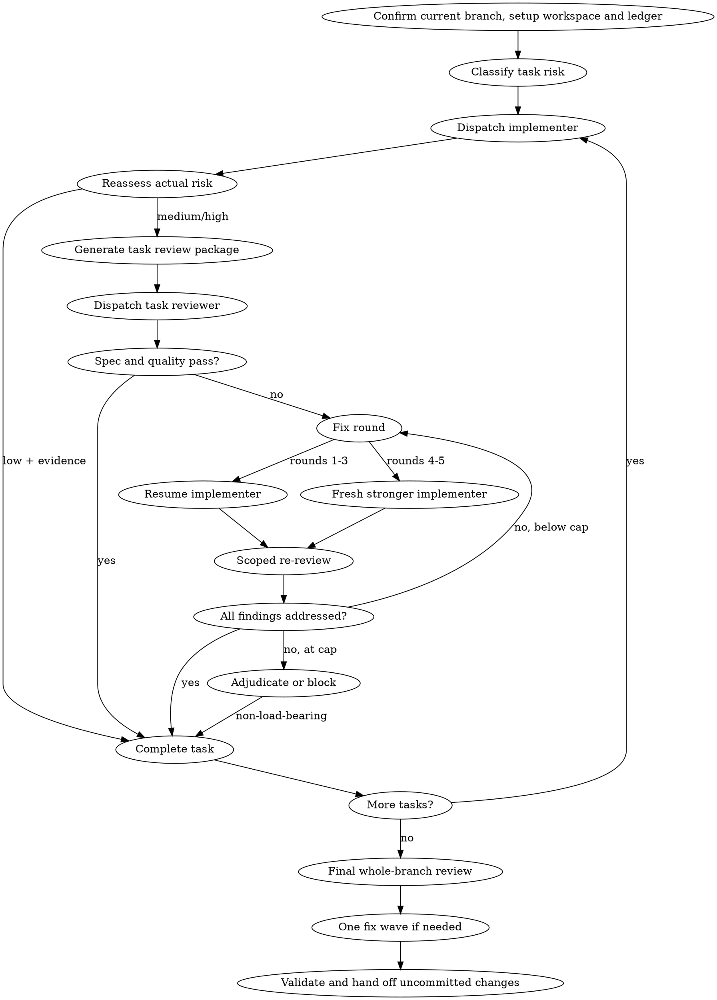

# Subagent-Driven Development Process Diagram

Read this only when a visual overview of the workflow is needed.

```dot
digraph process {
    rankdir=TB;

    "Confirm current branch, setup workspace and ledger" -> "Classify task risk";
    "Classify task risk" -> "Dispatch implementer";
    "Dispatch implementer" -> "Reassess actual risk";
    "Reassess actual risk" -> "Complete task" [label="low + evidence"];
    "Reassess actual risk" -> "Generate task review package" [label="medium/high"];
    "Generate task review package" -> "Dispatch task reviewer";
    "Dispatch task reviewer" -> "Spec and quality pass?";
    "Spec and quality pass?" -> "Complete task" [label="yes"];
    "Spec and quality pass?" -> "Fix round" [label="no"];
    "Fix round" -> "Resume implementer" [label="rounds 1-3"];
    "Fix round" -> "Fresh stronger implementer" [label="rounds 4-5"];
    "Resume implementer" -> "Scoped re-review";
    "Fresh stronger implementer" -> "Scoped re-review";
    "Scoped re-review" -> "All findings addressed?";
    "All findings addressed?" -> "Complete task" [label="yes"];
    "All findings addressed?" -> "Fix round" [label="no, below cap"];
    "All findings addressed?" -> "Adjudicate or block" [label="no, at cap"];
    "Adjudicate or block" -> "Complete task" [label="non-load-bearing"];
    "Complete task" -> "More tasks?";
    "More tasks?" -> "Dispatch implementer" [label="yes"];
    "More tasks?" -> "Final whole-branch review" [label="no"];
    "Final whole-branch review" -> "One fix wave if needed";
    "One fix wave if needed" -> "Validate and hand off uncommitted changes";
}
```
